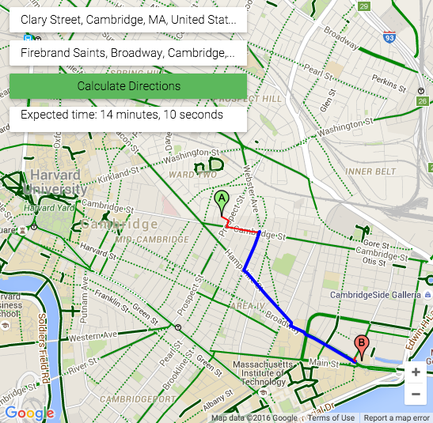

Fortunately, Boston has a plethora of non-driving transportation options: walking, public transit, bikesharing, not to mention uber or cabs. This itself creates another problem though -- finding bikeshare stations with bikes/docks available near my destination and deciding which routes are fastest. 

After getting stranded near [Boston Calling](http://bostoncalling.com/) last year, after all the nearby stations were temporarily shutdown, I decided to build this tool to calculate the total travel time (walking + biking) using up-to-date data via the [hubway API](http://www.thehubway.com/data/stations/bikeStations.xml). 

It isn't perfect or polished, but feel free to take a look.
